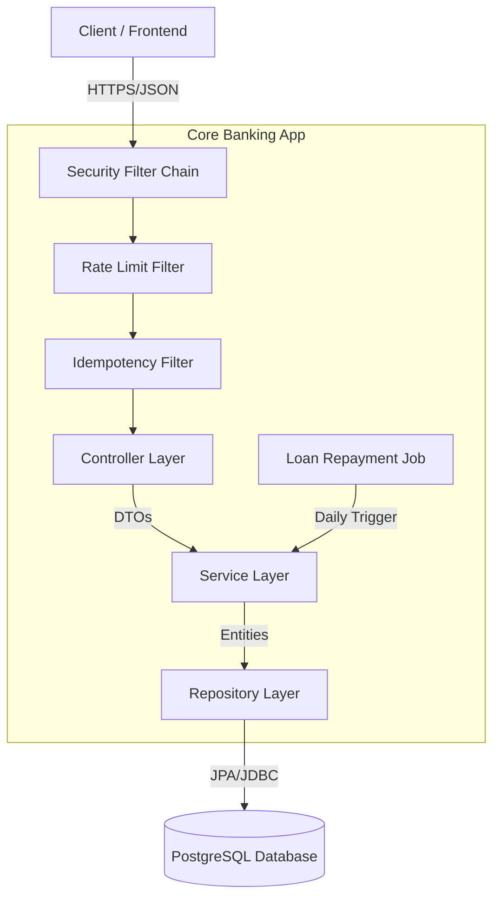

# Architecture Documentation

**Status:** Phase 2 Definition (Lending & Integrity)
**System:** Core Banking API

## System Architecture

The application follows a standard **Spring Boot Layered Architecture**, enforcing separation of concerns.

## Data Architecture

### Core Entities (Phase 1)
1.  **User (`users`)**
    *   Identity management, KYC data.
    *   Relationships: Has many Accounts.
2.  **Account (`accounts`)**
    *   Holds balance and currency.
    *   Critical: Subject to locking during transfers.
3.  **Transaction (`transactions`)**
    *   Immutable record of money movement.
    *   Fields: Source, Dest, Amount, Timestamp, Status.
4.  **AuditLog (`audit_logs`)**
    *   Tracking side-effects and (now) failed integrity checks.

### Phase 2 Entities (Lending & Integrity)
5.  **IdempotencyKey (`idempotency_keys`)**
    *   **Goal:** Prevent duplicate processing of financial requests (`FR-012`, `FR-013`).
    *   `key` (PK): UUID provided by client header `X-Idempotency-Key`.
    *   `user_id`: Link to creator.
    *   `response_status`: Cached HTTP code (e.g., 200, 422).
    *   `response_body`: Cached JSON payload (TEXT/JSONB).
    *   `created_at`: TTL management (e.g., 24h expiry).

6.  **Loan (`loans`)**
    *   `user_id`: Borrower.
    *   `principal`: Original debt (`FR-014`).
    *   `interest_rate`: Fixed APR.
    *   `emi_amount`: Pre-calculated monthly payment (`FR-016`).
    *   `status`: enum(`PENDING`, `ACTIVE`, `PAID_OFF`, `OVERDUE`, `REJECTED`).
    *   `next_due_date`: Indexable field for the Scheduler.
    *   `loan_type`: `PERSONAL`, `HOME`, etc.

### Database Design Patterns
*   **Migration:** Managed by Flyway (`src/main/resources/db/migration`).
*   **Locking:** Pessimistic Write locks (`SELECT ... FOR UPDATE`) used on `Account` rows.
*   **Precision:** All monetary fields use `DECIMAL` / `BigDecimal` with `RoundingMode.HALF_EVEN`.

## Security Architecture
*   **Authentication:** Stateless JWT (JSON Web Tokens).
*   **Flow:**
    1.  User POSTs credentials to `/api/auth/login`.
    2.  Server validates and signs a JWT.
    3.  Client attaches `Authorization: Bearer <token>` to subsequent requests.
    4.  `JwtAuthenticationFilter` intercepts requests, validates signature, and populates `SecurityContext`.

## API Design
*   **Style:** RESTful
*   **Format:** JSON
*   **Error Handling:** `GlobalExceptionHandler`.
*   **Idempotency:**
    *   Clients MUST send `X-Idempotency-Key` for `POST` requests.
    *   Server checks key existence *before* business logic.

## Concurrency & Locking Strategy (Lending Engine)
**The Scheduler Problem:**
The "Daily Repayment Job" (`FR-017`) runs in the background while users might be actively transferring money.

**The Solution:** STRICT ORDERING.
When the Scheduler needs to deduct an EMI:
1.  **Selection:** Identify active loans due today `WHERE next_due_date <= NOW()`.
2.  **Execution (Per Loan):**
    *   Start Transaction.
    *   **Acquire Lock:** `accountRepository.findByIdWithLock(userId)` (Pessimistic Write).
        *   *This blocks any user-initiated transfer until the repayment is processed.*
    *   Check Balance >= EMI.
    *   Deduct Funds & Log Repayment.
    *   Update Loan `next_due_date` or `status`.
    *   Commit (Lock Released).
3.  **Failure Handling:** If Balance < EMI, mark loan as `OVERDUE` (don't partial pay).

## Development & Deployment
*   **Local Dev:** `mvn spring-boot:run`
*   **Remote:** Deployed to Koyeb.
*   **Config:** `application.yml`.
